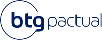
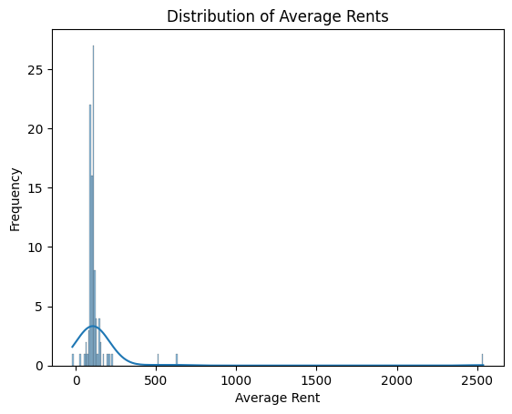

<table>
<tr>
<td>
<a href= "https://www.btgpactual.com/"></a>
</td>
<td><a href= "https://www.inteli.edu.br/"></a>
</td>
</tr>
</table>

# Projeto: Otimização de Precificação visando alcançar 100% do CDI em Ativos de Renda Fixa Sintética

# Grupo: Senoide

# Integrantes:

* [Gabrio Lina](https://www.linkedin.com/in/gabrio-lina-17ba60205/)
* [Moisés Cazé](https://www.linkedin.com/in/moises-caze/)
* [Pedro Romão](https://www.linkedin.com/in/pedro-romão-734b4920a/)
* [Sergio Lucas](https://www.linkedin.com/in/sergiobalucas/)
* [Thomas Barton](https://www.linkedin.com/in/thomasbartonlink/)
* [Thomas Brand](https://www.linkedin.com/in/thomas-frajhof-brand/)
* [Yasmin Vitória](https://www.linkedin.com/in/yasminvitóriarocha/)

# Descrição

O mercado financeiro apresenta duas categorias principais de ativos: renda fixa, que oferece retornos previsíveis, e renda variável, com retornos que flutuam conforme as condições de mercado. No Brasil, o CDI é uma taxa crucial, refletindo a média das taxas de juros em empréstimos entre bancos. Estratégias como o "cash and carry" podem simular a renda fixa sintética, importante para instituições como o BTG Pactual.

O BTG Pactual enfrenta o desafio de casar operações de compra e venda para manter seus ativos de renda fixa sintética. Este processo manual é propenso a erros, exigindo uma "emulação da verdade" para garantir conformidade regulatória e proteger os investidores. Uma solução proposta é utilizar redes neurais com aprendizado por reforço, semelhante a abordagens em outras áreas, como o casamento de perfis de usuários em redes sociais, ou problemas de engenharia como o "history matching problem". Essa abordagem visa atingir a precisão desejada para manter os ativos em conformidade com o padrão do mercado financeiro.

# Descrição Técnica

## Ambiente
Este ambiente de simulação recebe duas tabelas como entrada, uma contendo as vendas a termo e outra com as compras à vista. O estado modelado inclui os seguintes elementos:

Quantidade Restante de Compras: Indica quantas compras ainda são necessárias para igualar a quantidade de vendas.

Preço Médio das Vendas: Representa o preço médio das vendas a termo.

Média do Preço das Compras Selecionadas: Reflete a média dos preços das compras já selecionadas para aquela venda específica.

Preço Atual da Compra: Indica o preço da compra atualmente considerada pelo modelo.

Quantidade Restante da Compra: Mostra a quantidade restante disponível para compra.

Pontuação da Compra Atual: Refere-se à pontuação associada à compra que está sendo considerada no momento pelo modelo.

Aqui é interessante destacar a Pontuação da Compra Atual, que ajudou muito na aprendizagem do modelo. Esse cálculo toma como base a diferença entre o valor da compra, e o valor ideal para atingir 100% do CDI. 

Diferença de Preço em Relação à Meta: Representa a diferença entre o preço atual da compra e a meta de preço para fechar a venda.

Esses elementos compõem o estado do ambiente e são essenciais para orientar as decisões do agente de aprendizado por reforço. O objetivo do agente é aprender uma política de decisão que maximize a rentabilidade do portfólio, considerando as características e restrições específicas do problema. Ao interagir com o ambiente, o agente busca determinar a quantidade ideal a ser comprada em cada etapa de tempo, visando otimizar o desempenho global do sistema.

## Ações
O agente pode escolher entre um valor de 0 a 1, representando a porcentagem da compra que será usada para casar com a venda.

## Episódio
Um episódio se caracterzia como uma venda. O modelo passa por cada compra que tenha atributos de Código Cliente, Código Título, Vencimento, Código Corretora, todos iguais. O episódio acaba quando a venda é casada com um número de compras igual a quantidade de vendas que ela tem.

## Modelo
Implementamos o algoritmo de Proximal Policy Optimization (PPO) para resolver o problema apresentado no ambiente descrito anteriormente. O PPO é um algoritmo de aprendizado por reforço que visa otimizar políticas de decisão em ambientes de simulação. Ele funciona iterativamente, atualizando a política com base em amostras coletadas durante a interação do agente com o ambiente. No nosso projeto o agente aprende a tomar decisões sobre a quantidade ideal a ser casada em cada etapa de tempo, levando em consideração os estados do ambiente, tais como a diferença de preço entre a compra atual e a meta de preço para fechar a venda, a quantidade restante de compras e outras variáveis relevantes. O objetivo final do agente é manter o casamento entre compras e vendas com o a rentabilidade próxima de 100% do CDI.

## Resultados Obtidos
Fazendo a visualização do histograma, podemos ver que temos apenas 3 outliers que estouram o valor da rentabilidade para mais de 500%, 1 que fica abaixo e outro muito próximo de 0%.<br> 

<br>
Fazendo a exclusão desses outliers, que são de ações que distoam do comum (com valores por ação muito altos ou um número de quantidade muito acima do normal), chegamos ao resultado de uma rentabilidade média de 108.6% do CDI.

# Configuração e Execução

Para configurar e rodar a aplicação, siga os passos abaixo:
  [!WARNING][Certifique-se de que o Docker está instalado em sua máquina. Se não, você pode baixá-lo [aqui](https://www.docker.com/products/docker-desktop).]
  1. Clone o repositório para a sua máquina local:
        ```bash
        git clone https://github.com/Inteli-College/2024-T0001-CC09-G05.git
        ```
  2. Navege até o diretório `codigo/models`
  3. Faça Unzip do arquivo `100k_frames_1712825308 - UNZIP-ME`, copiando o conteúdo para a pasta `codigo/models`.
  4. Navegue até o diretório `codigo/modelo-reinforcement-learning`.
  5. Execute o comando `docker compose up`
  6. E a aplicação está pronta para ser acessada na url http://localhost:8501

### Pipeline CI/CD

O pipeline de Integração Contínua (CI) e Entrega Contínua (CD) automatiza a compilação, teste e implantação de nossa aplicação, garantindo que cada alteração feita no código seja imediatamente testada e pronta para produção. Utilizamos o GitHub Actions para gerenciar nosso pipeline CI/CD.

#### Estrutura do Pipeline

Nosso pipeline é definido no arquivo main.yml sob o diretório `codigo/ci-cd/.github/workflows`. Aqui estão os passos principais do nosso pipeline:

 - **Build**: Compila o código do projeto, garantindo que todas as dependências sejam corretamente instaladas.
 - **Test**: Executa uma série de testes automatizados para verificar se todas as funcionalidades estão operando como esperado.
 - **Deploy**: Se os testes forem bem-sucedidos, o código é automaticamente implantado em nosso ambiente de produção.

#### Pré-requisitos para Execução

- **Docker**: Certifique-se de que o Docker está instalado em sua máquina para a execução do ambiente de contêiner.
- **GitHub**: O código fonte está hospedado no GitHub, portanto, uma conta é necessária para acessar o repositório.

#### Execução do Pipeline

Para executar uma instância local do nosso pipeline, siga as instruções de configuração e utilize o comando abaixo para iniciar o processo no Docker:

```bash
docker compose up
```

Acesse a aplicação pelo navegador em http://localhost:8501 após a conclusão do processo de implantação.

# Documentação

Os arquivos da documentação deste projeto estão na pasta [/artefatos](/artefatos).

# Artigo

Os arquivos do artigo estão na pasta [/artigo](/artigo). 

O conteúdo deste artigo foi elaborado como parte das atividades de aprendizado dos alunos, mas precisa ser revisto e modificado caso haja a intenção de submetê-lo para uma eventual publicação.

# Licença

[Application 4.0 International](https://creativecommons.org/licenses/by/4.0/?ref=chooser-v1)


