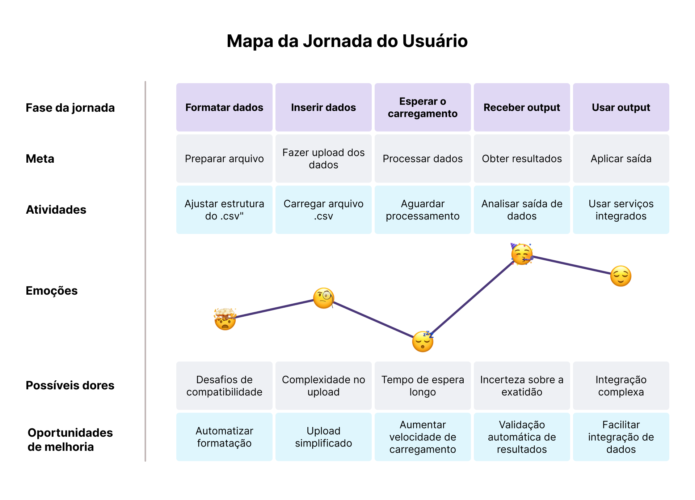
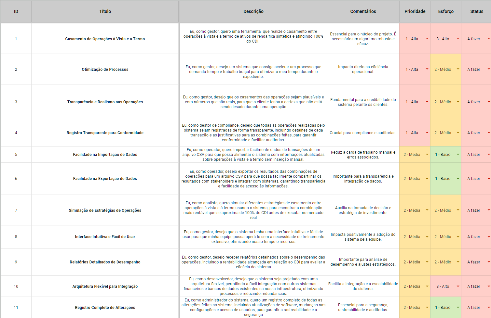
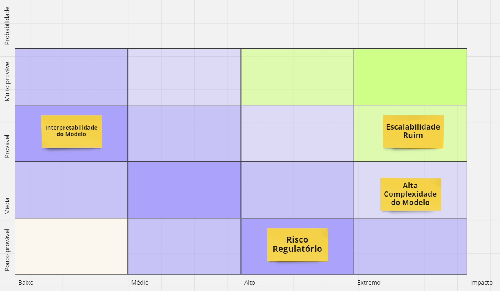
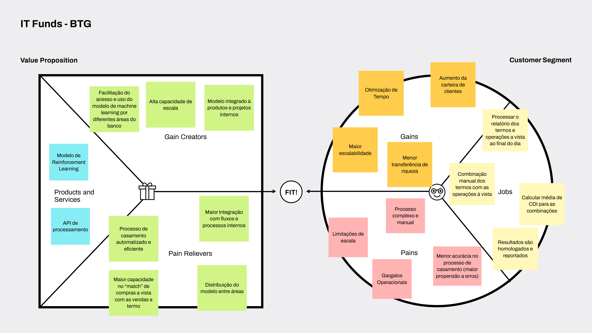

<table>
<tr>
<td>

</td>
<td>
</td>
</tr>
</table>

Nome do projeto

>*Observação 1: A estrutura inicial deste documento é só um exemplo. O seu grupo deverá alterar esta estrutura de acordo com o que está sendo solicitado nos artefatos.*

>*Observação 2: O índice abaixo não precisa ser editado se você utilizar o Visual Studio Code com a extensão **Markdown All in One**. Essa extensão atualiza o índice automaticamente quando o arquivo é salvo.*

**Conteúdo**

- [Entendimento do Contexto do Problema](#entendimento-do-contexto-do-problema)
  - [Problema](#problema)
  - [Solução Proposta](#solução-proposta)
  - [Utilização da Solução](#utilização-da-solução)
  - [Benefícios](#benefícios)
- [Entendimento da Experiência do Usuário](#entendimento-da-experiência-do-usuário)
  - [Personas](#personas)
  - [Jornada do Usuário](#jornada-do-usuário)
  - [User Stories](#user-stories)
- [Entendimento do Negócio](#entendimento-do-negócio)
  - [Matriz de Riscos](#matriz-de-riscos)
  - [Matriz SWOT](#matriz-swot)
  - [Canvas Proposta de Valor](#canvas-proposta-de-valor)
    - [Proposta de Valor](#proposta-de-valor)
    - [Segmento de Clientes](#segmento-de-clientes)
  - [Análise de Porter e Contexto da Indústria](#análise-de-porter-e-contexto-da-indústria)
    - [Análise da Indústria Bancária e Tendências](#análise-da-indústria-bancária-e-tendências)
    - [Poder de Barganha dos Clientes](#poder-de-barganha-dos-clientes)
    - [Poder de Barganha dos Fornecedores](#poder-de-barganha-dos-fornecedores)
    - [Ameaça de Novos Entrantes](#ameaça-de-novos-entrantes)
    - [Ameaça de Produtos Substitutos](#ameaça-de-produtos-substitutos)
    - [Rivalidade entre Concorrentes](#rivalidade-entre-concorrentes)
    - [Principais Concorrentes](#principais-concorrentes)
    - [Modelo de Negócios do Banco](#modelo-de-negócios-do-banco)
    - [Tendências](#tendências)
    - [Fontes:](#fontes)

# Entendimento do Contexto do Problema

## Problema

O problema refere-se à gestão e otimização da precificação de ativos sintéticos de renda fixa, que são feitos com a compra de um ativo à vista e a venda de um contrato futuro relacionado ao mesmo ativo. Quando o sintéticos de renda fixa é criado, não são identificados quais foram as compras à vista e vendas a termo correspondente a esse ativo. O objetivo é encontrar combinações ideais de negociações à vista de ações que correspondam aos contratos a termo, visando alcançar uma rentabilidade próxima a 100% do CDI.

No entanto, a complexidade surge na identificação dessas combinações ideais, pois o desafio consiste em equilibrar a rentabilidade do ativo sintético em torno do referencial de 100% do CDI. Se não for possível atingir essa rentabilidade ideal, busca-se estabelecer uma estrutura de termo de rentabilidade, onde a relação entre o vencimento do sintético e sua rentabilidade deve ser não-decrescente. Isso significa que à medida que o prazo de vencimento do ativo sintético aumenta, sua rentabilidade também deve aumentar, mantendo uma relação funcional coerente.

Assim, o problema envolve não apenas a identificação das combinações ótimas de negociações à vista de ações, mas também a necessidade de entender e gerenciar a relação entre o vencimento do ativo sintético e sua rentabilidade, de modo a garantir um retorno satisfatório em comparação com o CDI.

## Solução Proposta

A solução proposta utiliza Aprendizagem por Reforço para identificar os termos correspondentes dos ativos sintéticos de renda fixa. Isso implica o desenvolvimento de uma rede neural capaz de analisar e agrupar as transações realizadas, de modo a simular de forma precisa as relações entre essas transações. 

## Utilização da Solução

A rede neural será treinada para aprender padrões nos dados históricos das transações, identificando quais combinações de negociações à vista de ações correspondem aos contratos de termo específicos. Esse processo de aprendizado será reforçado por feedbacks recebidos ao longo do tempo, permitindo que a rede se ajuste e melhore sua precisão na precificação dos ativos sintéticos. Ao adotar essa abordagem, espera-se obter uma solução eficiente e precisa para a precificação desses ativos complexos, melhorando a tomada de decisão e otimizando os retornos financeiros.

## Benefícios

Com nosso projeto, almejamos alcançar uma compreensão mais refinada das relações entre as transações envolvidas na criação de ativos sintéticos de renda fixa, superando a precisão dos métodos atualmente empregados.

Além disso, visamos assegurar a escalabilidade desse processo de agrupamento de transações, especialmente em face das projeções de aumento significativo no volume de transações nos próximos anos. Ao adotar nossa solução, antecipamos a redução da necessidade de recursos humanos e a otimização do tempo necessário para executar esse processo, impulsionando a eficiência operacional e a capacidade de resposta às demandas do mercado de forma mais ágil.

# Entendimento da Experiência do Usuário

## Personas

A construção da persona é um processo fundamental para compreender as características e necessidades dos usuários em nossa plataforma. Ao delinear um perfil fictício baseado em dados reais, podemos visualizar de maneira concisa as motivações e desafios que os usuários enfrentam desde o primeiro contato até a consecução de seus objetivos. Essa representação simplificada da persona permite uma compreensão rápida e eficaz dos aspectos mais importantes em sua interação conosco, orientando-nos na criação de uma experiência mais centrada no usuário.

## Jornada do Usuário

A jornada do usuário é uma exploração visual e narrativa das interações do usuário com a plataforma. Ela nos ajuda a identificar pontos de contato críticos, potenciais obstáculos e oportunidades para encantar os usuários. O mapa da jornada do usuário abaixo ilustra o caminho típico que nossos usuários podem seguir ao interagir com nossa plataforma, desde o primeiro contato até alcançar seus objetivos.

## User Stories

As User Stories são essenciais para capturar e entender os requisitos funcionais do ponto de vista do usuário. Elas são formuladas de maneira a esclarecer o que o usuário deseja alcançar e por que. Abaixo, você encontrará uma série de User Stories que foram criadas para guiar o desenvolvimento das funcionalidades de nossa solução.

# Entendimento do Negócio

## Matriz de Riscos

## Matriz SWOT

A análise SWOT é uma ferramenta utilizada para guiar o planejamento estratégico, determinando fatores essenciais na tomada de decisões, abrangendo tanto o campo exterior quanto o interior de uma organização. A análise SWOT avalia forças, fraquezas, oportunidades e ameaças que são identificadas em um projeto ou que esse projeto pode enfrentar. A análise externa inclui forças e fraquezas, é tudo aquilo que está no controle de uma empresa, o qual tem a capacidade de mudá-los. Já a parte externa refere-se a oportunidades e ameaças, isso significa que a empresa reage e não tem o poder de influenciar ou controlar completamente esse meio.

Composição da matriz de análise SWOT
Forças: são fatores que indicam a vantagem competitiva;
Fraquezas: são fatores presentes que podem enfraquecer o negócio;
Oportunidades:contextos favoráveis que influenciam positivamente na vantagem;competitiva
Ameaças: situações e características que apresentam riscos que comprometem o negócio.

Desse modo, pode-se aplicar tal ferramenta na composição estratégica da solução em desenvolvimento, onde cada área é mapeada da seguinte forma no contexto atual:

 

Fraquezas
- Complexidade por envolver combinações de negociações à vista e a termo e a flutuaç~ies do mercado, dificultando a implementação e ajustes que requer grande expertise do mercado financeiro;
- Dependência de técnicas de aprendizagem por reforço que exige manutenção e consumo de recursos limitados que podem ser custosos;
- Difícil controle devido a implementação de futuras regulamentações que podem surgir ou serem modificadas(aumentando os requisitos do escopo).

 

Oportunidades
- Maior rentabilidade: otimização da rentabilidade dos ativos que pode tornar o serviço muito mais atrativo para potenciais investidores;
- Escalonamento: processo semelhante de otimização que pode ser expandido para outras classes de ativos além dos sintéticos de renda fixa;
- Inovação: diferencial de mercado que pode garantir vantagem competitiva em comparação aos concorrentes, visto que é uma forma automatizada que elimina processos manuais;
- Alcance global se bem sucedido, potencializando a ideia de expandir tal projeto para mercados diferentes em busca de garantir precificação justa para estes e atração de um maior público.

 

Ameaças
- Vulnerabilidade: o problema da aprendizagem por reforço perder a precisão ao passar do tempo, culminando em resultados que não atende as expectativas, podendo causar danos à imagem do banco ou perdas financeiras;
- Conjuntura de mercado e políticas econômicas que podem afetar a viabilidade do projeto, como ajuste na taxa de juros ou mudanças nas políticas fiscais que impacta na demanda de produtos financeiros;
- Volatilidade do CDI e da taxa Selic por exemplo, que podem dificultar tanto o planejamento como previsões adequadas, tornando suscetível a ameaça de redução nos retornos esperados.

 

Forças
- Mitigação do ganho de riqueza desigual, tendo maior assertividade na precificação;
- Menos intervenção manual;
- Atratividade com retornos estáveis que garantem ganhos a partir do cash and carry para quem busca bons retornos;
- Aumento da confiança que consequentemente aumenta a reputação do banco.

## Canvas Proposta de Valor

### Proposta de Valor

A proposta de valor se concentra em oferecer como produtos e serviços, um modelo de Reinforcement Learning e uma API de processamento que facilitam a automação, escalabilidade e eficiência dos processos. O objetivo é melhorar a capacidade e acurácia de combinação de compras e vendas a termo, integrando modelos de machine learning a produtos e projetos internos para criar ganhos como acesso facilitado, alta escalabilidade e melhor integração de fluxos internos.

### Segmento de Clientes

Para o segmento de clientes, os ganhos incluem a otimização do tempo, maior escalabilidade e redução na transferência de riqueza. Atualmente, os clientes enfrentam dificuldades como processos manuais complexos, gargalos operacionais, limitações de escala e menor precisão no processo de correspondência financeira, o que pode levar a mais erros e em uma menor capacidade para lidar com novos clientes do banco. Os processos atuais incluem o processamento de relatórios diários das ordens de compra e venda, combinação manual de operações e cálculo da média do CDI para as combinações, com a finalidade de homologar e reportar resultados dentro do próprio banco.

## Análise de Porter e Contexto da Indústria

### Análise da Indústria Bancária e Tendências
Em 2024, a indústria bancária de investimentos adentra um ambiente global complexo, marcado por um crescimento econômico global esperado em torno de 3,0%, com economias emergentes, como a Índia, mostrando um potencial de crescimento robusto em contraste com o avanço mais lento das economias desenvolvidas. De acordo com a Delloite, é esperado que a inflação global caia para 5.2%. O crescimento econômico da China pode ser atenuado, fator que também gera impacto na cadeia global econônica, incluindo Brasil. Além disso, a volatilidade do mercado de ações e o crescimento moderado dos ganhos destacam a necessidade de estratégias de investimento que busquem menos risco. Paralelamente, com Open Banking no Brasil e Europa, e com Estados Unidos modificando algumas políticas, há um relaxamento no compartilhamento de dados, dentro dos limites e políticas de privacidade, que somados a rápida adoção de tecnologias disruptivas, como blockchain e inteligência artificial, promete transformar a eficiência operacional e inovar nos produtos financeiros, aumentando a competitividade no setor.
​
### Poder de Barganha dos Clientes
A expansão dos serviços digitais bancários tem proporcionado aos clientes uma maior liberdade para escolher entre diferentes fornecedores, especialmente no setor de investimentos. Essa tendência amplia o poder de barganha dos clientes, incentivando a competição entre os bancos para reter e atrair novos usuários.

### Poder de Barganha dos Fornecedores
No que diz respeito a insumos físicos e operacionais, as instituições financeiras, incluindo o BTG Pactual, mantém uma ampla gama de fornecedores, mitigando o poder de barganha destes. Contudo, no segmento tecnológico, especialmente em cloud computing, a diversidade de fornecedores é limitada, aumentando sua influência e poder de negociação devido à dependência de tecnologias específicas e infra estruturas legadas.

### Ameaça de Novos Entrantes
A natureza altamente regulamentada do setor bancário estabelece barreiras significativas à entrada de novos concorrentes. No entanto, iniciativas como Open Banking, PIX, e a tendência de digitalização têm facilitado a entrada de novos players, apesar de alguns desafios regulatórios e operacionais. Superapps representam uma inovação disruptiva, oferecendo serviços financeiros integrados que podem atrair clientes buscando conveniência, ampliando a competição no setor.

### Ameaça de Produtos Substitutos
A diversificação da carteira de produtos do BTG Pactual e suas parcerias estratégicas fortalecem sua posição no mercado, minimizando a ameaça de substituição. A reputação e a solidez da instituição conferem uma vantagem competitiva na introdução de novos produtos. Entretanto, a evolução dos produtos financeiros digitais e o crescimento de concorrentes digitais representam potenciais desafios futuros.

### Rivalidade entre Concorrentes
A competição no setor bancário é intensa, tanto entre bancos tradicionais quanto digitais. A luta pela retenção de clientes, incluindo aqueles de alto valor, é uma constante. O BTG Pactual mantém uma posição de destaque em segmentos como gestão de patrimônio e ativos, mas a presença de competidores robustos fomenta uma rivalidade acirrada, pressionando por inovações e melhorias contínuas no serviço.

### Principais Concorrentes
Os principais concorrentes incluem bancos clássicos como Itaú Unibanco, Bradesco, Banco do Brasil e instituições menores no mercado financeiro. No setor de Wealth Management e Asset Management, concorrentes como XP asset management, Safra e Reag Investimentos são notáveis.

### Modelo de Negócios do Banco
Considerado o Maior Banco de Investimento da América latina, ele se apresenta ao mercado oferecendo um portfólio diversificado de negócios, variando de varejo até investimentos e produtos high profile premium. Com foco em rentabilidade, o banco opera sob um modelo de Partnership, focando no capital e seu valor agregado, além de ser administrado por Partners seniores. Além disso, busca construir e manter um relacionamento estruturado e consistente com seus clientes, fortalecendo seu posicionamento local e global.

### Tendências
Com a introdução do Open Banking pelo banco central, e na perspectiva do Open Investment, enxerga-se uma tendência de descentralização de serviços e produtos financeiros, aumentando a participação de outras instituições e de players menores. Outra grande tendência é o avanço dos “SuperApps”, onde a utilização centralizada de funcionalidades e mini-apps, podem facilitar a criação de leads para sistemas financeiros agregados e acoplados, afetando a concorrência no mercado. Por último, percebe-se a grande tendência da digitalização de serviços financeiros no geral, processo catalisado pela pandemia, incluindo o fechamento de agências físicas. Com relação ao BTG, percebe-se um avanço na esfera nacional e da américa latina, e sua introdução de forma mais ativa no mercado global.

### Fontes:
- [NeoFeed - BTG Pactual entra na disputa das contas internacionais](https://neofeed.com.br/wealth-management/btg-pactual-entra-na-disputa-das-contas-internacionais/)
- [Valor-Investe - Globo - BTG compra banco em Luxemburgo por 21,3 milhões de euros](https://valorinveste.globo.com/mercados/renda-variavel/empresas/noticia/2023/03/24/btg-compra-banco-em-luxemburgo-por-213-milhes-de-euros.ghtml)
- [Bloomberg Linea - Brasil perde mais de 2300 agências bancárias em 2 anos de pandemia](https://www.bloomberglinea.com.br/2022/01/14/brasil-perde-mais-de-2300-agencias-bancarias-em-2-anos-de-pandemia/)
- [Gizmodo - BC prevê extinção dos apps de bancos em 2 anos; entenda como](https://gizmodo.uol.com.br/bc-preve-extincao-dos-apps-de-bancos-em-2-anos-entenda-como/)
- [TecMundo - Brasil é o país com mais contas em bancos digitais no mundo](https://www.tecmundo.com.br/mercado/257954-brasil-pais-contas-bancos-digitais-mundo.htm)
- [EMIS - Setor bancário no Brasil](https://www.emis.com/pt/blog/setor-banc%C3%A1rio-no-brasil)
- [Febraban Tech - Metaverso, Superapps, IA e muito mais: veja as 10 tendências tecnológicas para 2023](https://febrabantech.febraban.org.br/blog/metaverso-superapps-ia-e-muito-mais-veja-as-10-tendencias-tecnologicas-para-2023)
- [Suno Notícias - Donos do mercado financeiro: quem são as maiores gestoras de fundos de investimento do Brasil?](https://www.suno.com.br/noticias/editoria-fundos-gestoras-maiores-donas-mercado-financeiro/)
- [BTG Pactual RI - Sobre o Banco: Vantagens Competitivas e Estratégia](https://ri.btgpactual.com/sobre-o-banco/vantagens-competitivas-e-estrategia/)

- [Deloitte Insights - 2024 banking and capital markets outlook](https://www2.deloitte.com/us/en/insights/industry/financial-services/financial-services-industry-outlooks/banking-industry-outlook.html)

- [J.P. Morgan Research - Market outlook for 2024: Slow global growth clouds forecast for equities](https://www.jpmorgan.com/insights/global-research/outlook/market-outlook)

- [McKinsey - Global Banking Annual Review 2023: The Great Banking Transition](https://www.mckinsey.com/industries/financial-services/our-insights/global-banking-annual-review)
- [Accenture - Top 10 banking trends for 2024](https://www.accenture.com/us-en/insights/banking/top-10-trends-banking-2024)