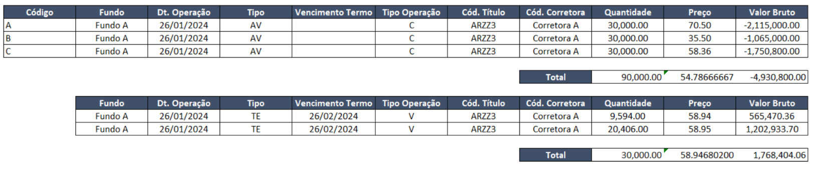
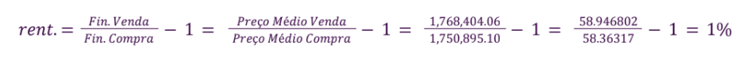
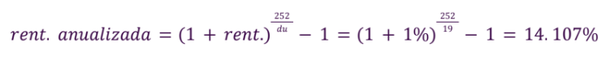
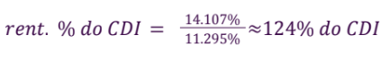

# Introdução

Neste documento, pretende-se elaborar a contextualização do emprego da inteligência artificial por meio de aprendizado por reforço e redes neurais, com o objetivo de substituir as atividades atualmente realizadas com planilhas do Excel.

A abordagem que será adotada seguirá a estrutura técnica convencional de uma inteligência artificial que emprega aprendizado por reforço e redes neurais. Portanto, os tópicos subsequentes serão organizados em torno dos conceitos de agente, ambiente, ações e estados.

Para facilitar o acesso deste conteúdo para qualquer nível de entendimento técnico, iremos realizar o contraste entre o trabalho manual que acontece na ausência de nossa solução, e a automação que é a finalidade do projeto.

# Contexto de Uso

O atual contexto de uso é que o Leonardo, funcionário do setor de fundos do banco BTG Pactual, tem como uma de suas responsabilidades realizar os casamentos entre compras à vista de ativos de renda variável e operações a termo de venda e compra desses títulos. Isto é chamado de renda fixa artificial, juntando a compra desses ativos com a venda de termos para garantir dinheiro aquele que vende o ativo a termo, e rendimento garantido para aquele que fornece o dinheiro para comprar o ativo.



<p align="center"><em>Imagem 1: Exemplo real de casamento</em></p>

Em muitos casos, existe o que é chamado "casamento perfeito", ou seja, não há a necessidade de verificar quais compras correspondem a quais termos; basta checar os indicadores principais, como data de vencimento, valor total, e o nome do ativo específico. 

## Ambiente

O ambiente no contexto do Leonardo é a planilha onde ele centraliza todas as informações sobre as compras e termos, e utiliza suas informações para realizar novos casamentos e analisar os já existentes. Este ambiente pode ser abstraído para qualquer centralização de informações sobre esses dados; seja VBA, Python, etc. 

Devido ao caso real, o ambiente deve obrigatoriamente apresentar informações como o código do produto, o fundo que ele pertence, a data de operação, o tipo de transação, o vencimento do termo, o tipo de operação, o código do título, o código da corretora, a quantidade, o preço, e o valor bruto. 





<p align="center"><em>Imagens 2 á 4: Cálculos para chegar no valor do CDI</em></p>

Os exemplos das imagens acima podem ser entendidos como o resultado de um casamento não perfeito ideal, onde o valor não foge muito de 100% do CDI. 

É importante notar que mesmo que o CDI seja uma âncora do projeto; ou seja, é uma base de valor ideal, o objetivo é normalizar o rendimento de todos os casamentos de maneira com que nenhum deles seja lesado. Logo, no caso do fundo estar indo "muito bem", e todos os casamentos passarem de 100% do CDI, é importante que esta distribuição se centralize numa média. Desta maneira, é possível avaliar se o fundo está sendo bem sucedido e não está lesando nenhum participante, ou se está sendo mal sucedido, porém ainda sim, não lesa nenhum participante. 

## Episódio:

Em uma rede neural de Aprendizado por Reforço (Reinforcement Learning), um episódio representa uma sequência completa de interações entre um agente e um ambiente. Durante um episódio, o agente toma uma série de ações com base em sua política de tomada de decisão, e o ambiente responde a essas ações, fornecendo feedback na forma de recompensas ou penalidades.


Durante o treinamento, múltiplos episódios serão executados para permitir que os agentes aprendam e melhorem suas estratégias ao longo do tempo. Após o treinamento, o modelo resultante pode ser usado para fazer predições ou tomar decisões em novos cenários.


A seguir, são descritas as cenas que compõem um episódio e como os agentes interagem em cada uma delas.

### Cena 1: Preparação


No início do dia, os Agentes Termos examinam atentamente as oportunidades de casamento disponíveis. Com seus algoritmos afiados, eles calculam minuciosamente as probabilidades de atingir a rentabilidade desejada, próxima a 100% do CDI. Enquanto isso, os Agentes Compras analisam as propostas de casamento que chegam até eles, buscando aquelas que contribuirão para uma média de rentabilidade estável.


### Cena 2: Casamentos


Os Agentes Termos fazem suas propostas, apresentando unidades e preços atraentes aos Agentes Compras. Algumas propostas são aceitas imediatamente, enquanto outras são ponderadas cuidadosamente. Os Agentes Compras consideram não apenas o retorno imediato, mas também como cada casamento pode influenciar a média geral de rentabilidade.


### Cena 3: Validação


Com os casamentos concluídos, entram em cena os Agentes Validadores. Eles examinam os resultados, avaliando a variância das rentabilidades e comparando a média com o CDI. Casamentos que se desviam muito do esperado são separados para a criação de novos, enquanto aqueles que contribuem para uma média estável são mantidos.


### Cena 4: Ajustes


Os Agentes Termos buscam novamente por oportunidades de casamento, refinando suas estratégias com base nos resultados anteriores. Da cena 1 a 4 é rodado em loop, até que o Agente Validador obtenha um resultado que ele aceite.


### Cena 5: Final


O Agente Validador decide que o resultado é aceitável e para de desfazer casamentos entre Agentes Termos e Agentes Compras, assim, chegando ao fim do episódio.


# Elementos-chave

Os componentes fundamentais de uma inteligência artificial baseada em aprendizado por reforço incluem o agente, que é o elemento que executa ações no ambiente; as próprias ações, que refletem as mudanças de estado realizadas pelo agente; o estado, que indica a posição atual do agente em relação ao ambiente; e a recompensa, que avalia se as ações do agente são benéficas ou prejudiciais, abaixo iremos contextualizar os mesmos quanto ao projeto.

Neste momento, o mapeamento de elementos chave se diz respeito apenas aquilo que foi encontrado no TAPI. Logo, o contexto de quais dados serão manipulados são exatamente os mesmos que foram discorridos na seção de [contexto de uso](#contexto-de-uso) e demonstrados na imagem 1, sendo estes "Fundo", "Data da operação", "Tipo", "Vencimento do termo", "Tipo de operação", "Código do título", "Código da corretora", "Quantidade", "Preço", "Valor bruto", e a agregação das últimas 3 grandezas, o "Total". 

## Agente

Agente é aquele que toma as ações; a força por trás das decisões.

O agente no contexto do banco, ou seja, aquele que realiza as tarefas diariamente, é o já mencionado Leonardo. Leonardo é o responsável por manter controle da planilha, a checar diariamente, e atender as demandas dos casamentos conforme o necessário.

No contexto do projeto, o agente será nosso modelo de inteligência artificial utilizando redes neurais e aprendizado por reforço. Visando otimizar as decisões que Leonardo toma em sua jornada de trabalho.

### Agente Validator

- Valida transações financeiras para que elas atendam os critérios definidos;
- Verifica se as ações tomadas por outros agentes seguem as restrições estabelecidas;
- Valida resultados de determinadas operações para garantir a corretude e confiabilidade dos outputs;
- Filtra ofertas em que já tenha o casamento, aceitando ou rejeitando com base nas regras/restrições definidas.
- Desconectar casamentos.

## Ações

As ações são aquilo que de fato acontece; o que é manipulado ou alterado no sistema para chegar no objetivo. 

No seu dia-a-dia, para executar esta tarefa, a rotina de Leonardo pode ser reduzida para retirar e inserir novas entradas de ou compras a vista, ou a termo, no casamento que montou, e analisar se sua escolha foi ideal para seu caso específico. 

O nosso modelo, o agente, também irá tomar essas ações, porém, sua principal vantagem é que pelo seu ciclo de recompensa e punição, eventualmente ele irá descobrir vícios e segredos nos dados que irão o fazer tomar essas decisões otimizadas mais rápido e eficientemente.

## Estado

O estado é entendido como a localização do sistema; sendo uma das localizações, o objetivo. 

Na planilha de Leonardo, o estado é o casamento atual que ele está trabalhando. Englobando todas as contas citadas anteriormente no ambiente e o casamento utilizando as grandezas citadas anteriormente. 

Para o sistema, não necessariamente precisa ser uma planilha, apenas uma agregação de dados que o modelo consiga trabalhar e manipular utilizando as ações já citadas anteriormente. Porém, é necessário ter o controle de como está um casamento, para que seja possível punir ou recompensar as ações do sistema. 

## Recompensa

A recompensa pode ser positiva ou negativa; um reforço ou punição de acordo com as ações do agente. 

É neste ponto em que o ser humano mostra maior dificuldade em relação á maquina, pois Leonardo, pela limitação natural humana, tem fatores de recompensa que variam, e viéses que são introduzidos em seu dia-a-dia que o impedem de, com clareza, sempre definir qual é uma recompensa objetiva para as ações que toma em um casamento. 

Já o sistema consegue não só ter definido objetivamente quais são as recompensas e punições, como também consegue descobrir viéses nos dados e maneiras mais eficientes de se chegar no objetivo definido. 

As funções de recompensa no contexto deste projeto são definidas com foco na otimização de casamentos entre posições à vista e a termo, considerando diversos fatores chave para a performance dos agentes. Estes fatores incluem a eficiência operacional, a diversificação de ativos, e a minimização do número de steps (ações) necessárias para alcançar o objetivo final.

### Função de Recompensa dos Agentes Termo

A função de recompensa para os Agentes Termos é estruturada para encorajar a aproximação da rentabilidade ajustada das operações ao valor de 100% do CDI. A formulação matemática é:

**Rentabilidade**:

```math
Rentabilidade = (PreçoMédioVenda / PreçoMédiaCompra) - 1
```

A rentabilidade calcula a diferença percentual entre o preço médio de venda e o preço médio de compra, ajustada pelo número de dias úteis (252 no ano financeiro), resultando na rentabilidade anualizada:

**Rentabilidade Atualizada**:

```math
RentAtualizada = (1 + Rentabilidade)(252 / du) - 1
```

Onde du representa a quantidade de dias úteis entre o início da operação e a liquidação. A próxima etapa é calcular a relação dessa rentabilidade atualizada com a taxa do CDI do período (di):

**CDI do casamento**:

```math
CdiCasamento = (RentAtualizada / d1)  100
```

Finalmente, a recompensa é definida para incentivar a maximização dessa proporção em relação a 100%, com um tratamento diferenciado para quando a rentabilidade está acima ou abaixo desse limiar:

```
Se CdiCasamento >= 100:
Retorno = 100 - (CdiCasamento - 100)

Se CdiCasamento < 100:
Retorno = 100 - (100 - CdiCasamento) 2.5
```
A diferença em tratamento reflete a penalidade maior para rentabilidades abaixo de 100% do CDI, visando encorajar os agentes a buscar estratégias que maximizem o retorno ajustado pelo risco.


### Função de Recompensa dos Agentes Compra

Para os Agentes Compras, a função de recompensa calcula a diferença absoluta entre a rentabilidade de uma operação específica e a média das rentabilidades de todas as operações já realizadas:

```math
Retorno = 1 - | Rentabilidade - (∑Rentabilidades[i] / n) |
```
	
Aqui, a rentabilidade de cada "casamento" é comparada à média `(∑Rentabilidades[i] / n)` das rentabilidades de todos os casamentos realizados, onde n é o número total de compras à vista. A ideia é incentivar a seleção de casamentos que contribuam para uma média de rentabilidade mais estável e previsível, promovendo uma harmonização no retorno dos investimentos.

### Função de Recompensa dos Agentes Validadores

A recompensa para os Agentes Validadores é projetada para minimizar a variância das rentabilidades, ao mesmo tempo em que busca aproximar a média das rentabilidades de 100% do CDI:

**Variância dos rendimentos**:

```math
VariânciaRendimentos = (∑(Rentabilidades[i] - MédiaRendimentos)²) / n
```

**Média do CDI**:
```math
MédiaCdi = (∑CdiCasamentos[i]) / n
```

**Retorno**:
```math
Retorno = 100 - VariânciaRendimentos - |100 - MédiaCdi|
```

Essa estratégia de recompensa busca uma dupla otimização: reduzir a dispersão das rentabilidades (através da minimização da variância) e alinhar a média das rentabilidades em relação a um benchmark ideal (100% do CDI). Ao focar na variância, incentiva-se a busca por estratégias que garantam um retorno mais consistente e previsível, enquanto a penalidade pela distância da média em relação ao CDI encoraja uma aproximação ao ideal de rentabilidade ajustada pelo risco.

# Conclusão

Este projeto é baseado na automatização de um trabalho manual, ou seja, uma substituição de um fator humano por um sistema inteligente que consegue se adaptar para mudanças futuras e escalar com demanda. 

A escolha de um sistema de aprendizado por reforço utilizando redes neurais pode ser entendida como a mesma de um sistema que pretende substituir um jogador real de xadrez ou jogos eletrônicos como "Starcraft"; é impossível mapear, com certeza absoluta, todas as possíveis combinações de casamento, porém, é possível treinar uma rede que consegue aprender com seus erros e em cada iteração chegar mais próximo de uma resposta ótima. 

Para as necessidades técnicas do banco BTG, a solução proposta se apresenta como plausível e adequada para solucionar o problema. 